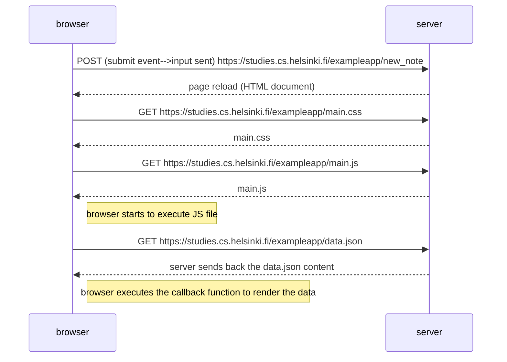

```mermaid
  sequenceDiagram
      participant browser
      participant server
      
      browser->>server: POST (submit event-->input sent) https://studies.cs.helsinki.fi/exampleapp/new_note
      server-->>browser: page reload (HTML document)
      
      browser->>server: GET https://studies.cs.helsinki.fi/exampleapp/main.css
      server-->>browser: main.css
  
      browser->>server: GET https://studies.cs.helsinki.fi/exampleapp/main.js
      server-->>browser: main.js
  
      Note right of browser: browser starts to execute JS file
  
      browser->>server: GET https://studies.cs.helsinki.fi/exampleapp/data.json
      server-->>browser: server sends back the data.json content
  
      Note right of browser: browser executes the callback function to render the data

```
